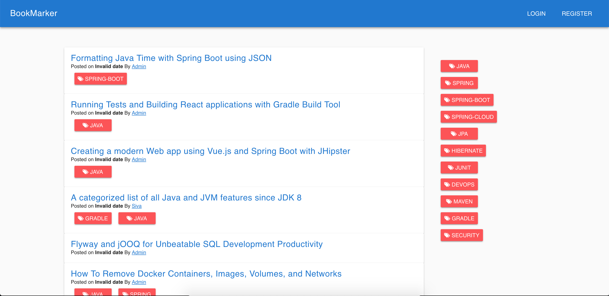
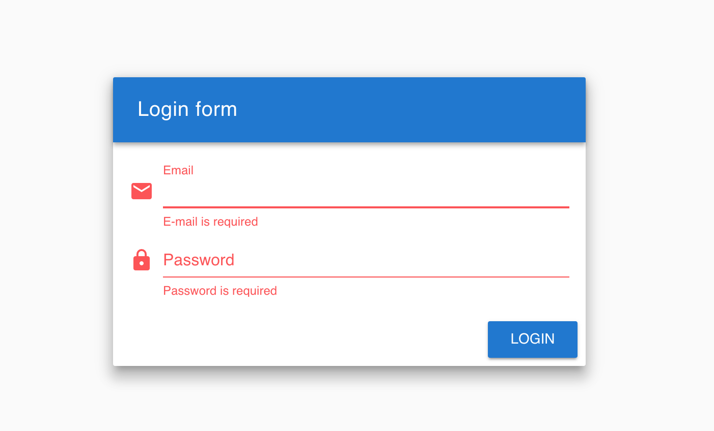
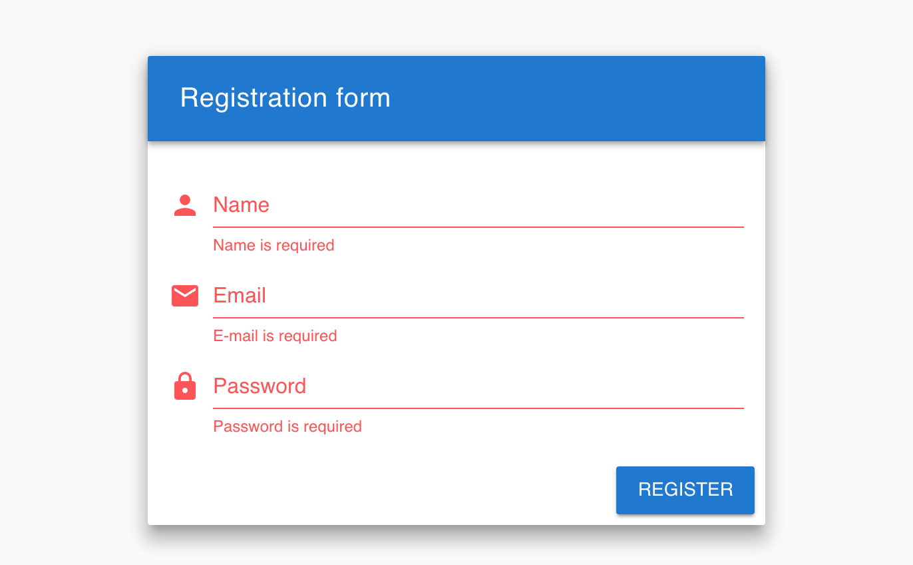
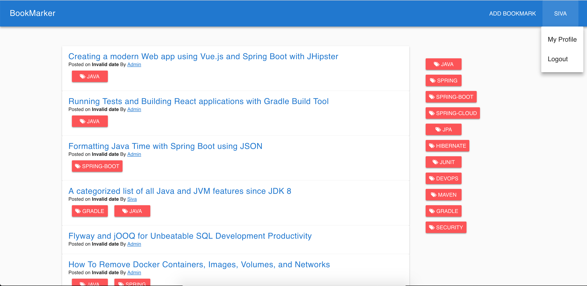
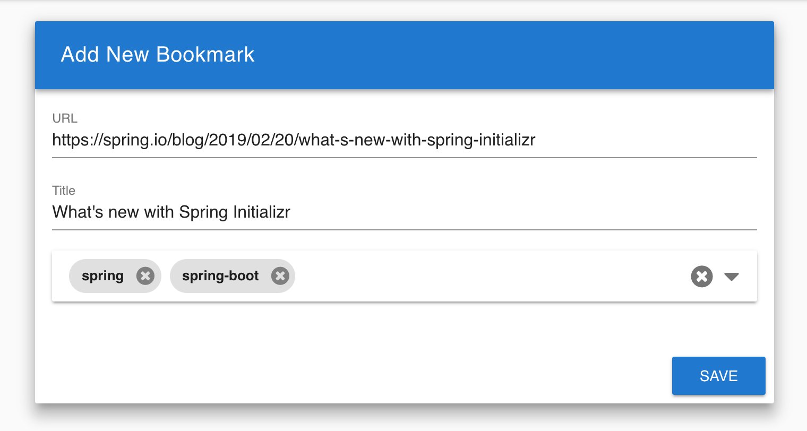

# Bookmarker

Bookmarker is a simple bookmarking application developed using Kotlin, SpringBoot, VueJS.

## Motivation
The motivation behind building this simple application is try out stuff before using in production apps.
There are plenty of new tools, libraries and frameworks coming in everyday. 
I personally don't like using new tools without playing around with them for a while 
because "Everything just works great in HELLO WORLD apps" :wink: but is hard to use in real projects.

Also, occasionally we want to quickly try out something to see if it is working or not.
Trying them in our real application might not be easy because of various reasons.
So, in those situations having a simple but not as simple as Hello World app comes handy.
Hence this **Bookmarker** application :-)


[](https://travis-ci.org/sivaprasadreddy/bookmarker)
[](https://sonarcloud.io/dashboard?id=com.sivalabs%3Abookmarker)

#### Live Demo 
https://sivalabs-bookmarker.herokuapp.com/

## Backend Tech Stack
* Java8 / Kotlin
* SpringBoot 2.x
* H2(Dev) / Postgres (Prod)
* Spring Data JPA
* Spring Security JWT Authentication
* Jasypt
* Swagger2
* Rest-assured
* Zalando problem-spring-web
* Flyway
* SonarQube
* Jacoco
* Maven
* JUnit 5, Mockito, Testcontainers
* ktlint, detekt

## Frontend Tech Stack
* VueJS 2.x
* Vuex, Vue-router
* Vuetify
* Vuelidate
* Axios
* Font-awesome

## How to run?

### Run Backend tests

`bookmarker/backend> ./mvnw clean verify`

### Run application locally

`bookmarker> ./mvnw clean package & java -jar backend/target/bookmarker-0.0.1.jar`

### Running using Docker

To start application and Postgres

`> ./run.sh start`

To start application and all dependent services like ELK, grafana, prometheus

`> ./run.sh start_all`

* Application: http://localhost:8080/
* SwaggerUI: http://localhost:8080/swagger-ui.html
* Prometheus: http://localhost:9090/
* Grafana: http://localhost:3000/ (admin/admin)
* Kibana: http://localhost:5601/ 

### Run Performance Tests

`performance-tests> ./gradlew gatlingRun`

### Run SonarQube analysis

```
> ./run.sh sonar
> ./mvnw clean verify -P sonar -Dsonar.login=$SONAR_LOGIN_TOKEN
```

## Screenshots

##### Home Page


##### Login Page


##### Registration Page


##### User Home Page


##### Add Bookmark Page


##### User Profile Page


## TODO

* User forgot password, reset password
* Bookmark like feature
* Weekly Email NewsLetter
* Improve Test coverage
* Refactor Gatling tests to simulate typical user behaviour
* Script to automatically create Grafana dashboard
* Add gradle based build
* ~~Use Mockk instead of Mockito~~ :white_check_mark:
* ~~Deploy on Heroku~~ :white_check_mark:
* ~~Use Vuetify for UI~~ :white_check_mark:


## Contributing
If you want to contribute to add new feature or improve existing code quality 
please raise issues and ofcourse, Pull Requests are welcome.

## References

* https://spring.io/projects/spring-boot
* https://start.spring.io/
* https://prometheus.io/
* https://grafana.com/
* https://docs.docker.com/
* https://jenkins.io/doc/
* https://www.elastic.co/elk-stack
* https://gatling.io/
* https://www.sonarqube.org/
* https://sonarcloud.io/
